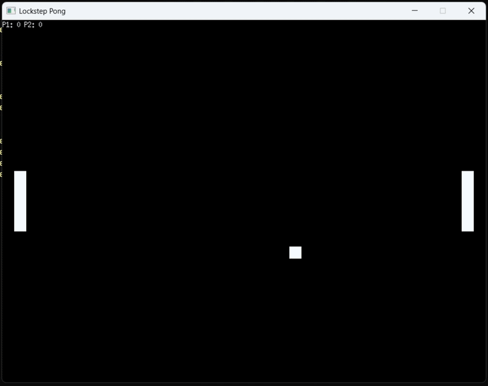
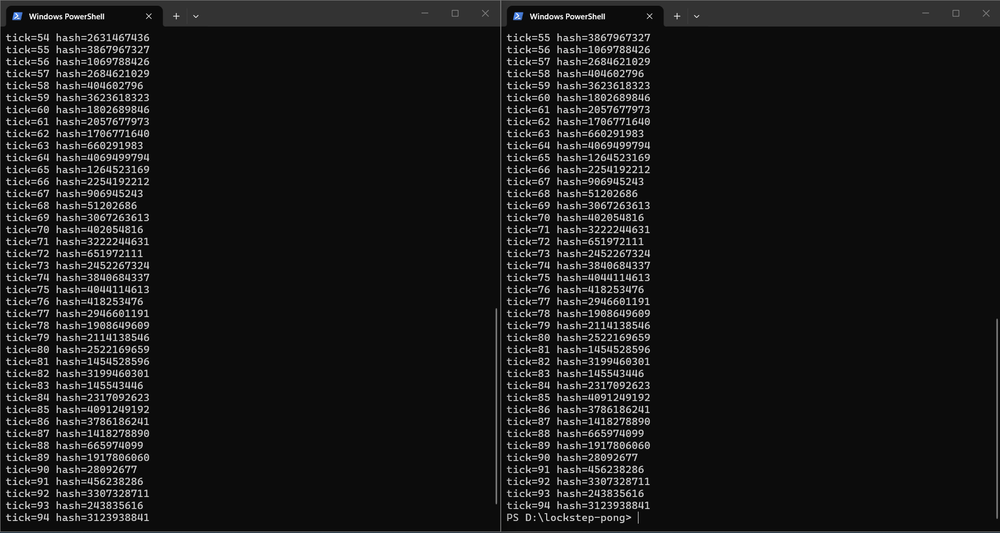
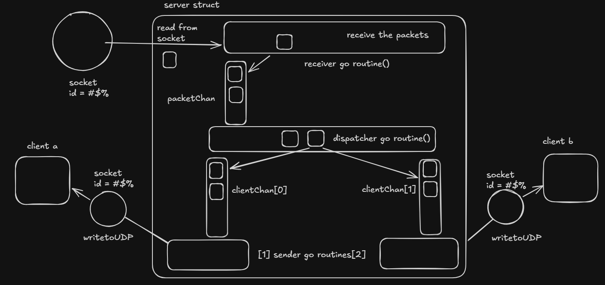

# lockstep-pong

A deterministic multiplayer Pong implementation using **lockstep networking** — the same architecture used by StarCraft, Age of Empires, and modern fighting games.

Written in **Go + C**, with the simulation core in C and networking logic in Go.

---
This is my first project using C. learned about memory layout,struct padding, deterministic simulation and interfacing Go with C via CGo.

## Demo

> Local two-player mode — W/S for P1, Up/Down for P2



---

## What is lockstep networking

Most multiplayer games send game state over the network — positions, health, velocities — every frame. This is bandwidth heavy and gives the host an unfair advantage.

Lockstep works differently. Every client runs the **exact same deterministic simulation independently**. Only player inputs are sent over the network — not state. Since both simulations start from the same state and receive identical inputs in the same order, they always arrive at identical state.

The result: two machines stay perfectly in sync using **14 bytes per packet** instead of sending full game state.

This is how StarCraft (1998) handled 200+ units per player over dial-up. This is how every major fighting game works today.

---

## Verified sync

Two independent processes, zero shared memory, synced only via UDP input packets. FNV-1a hash computed every tick and compared across clients:



Every hash matches across both clients for the entire session.

---


### System overview



The relay server is intentionally stateless — it has no game logic. It receives raw UDP packets and broadcasts them to all connected clients. The intelligence lives entirely in the clients.

**Inside the server:**
- A receiver goroutine continuously reads packets from the UDP socket and pushes them into   packetChan
- A dispatcher goroutine consumes packets from packetChan and broadcasts them to all connected clients
- Each client has its own clientChan and dedicated sender goroutine
- Sender goroutines forward packets back to clients using WriteToUDP

Packets are broadcasted to all clients so every client receives the complete input set for each simulation tick, allowing all clients to independently run the same deterministic simulation state.

### Wire protocol

```
| tick (8 bytes) | playerID (1 byte) | keys (1 byte) | checksum (4 bytes) |
```

14 bytes total. Big endian. Keys are a bitmask — bit 0 is up, bit 1 is down. The checksum carries the FNV-1a hash of the sender's game state for divergence detection.


## How to Run

```bash
# local two-player (one machine, one window)
./lockstep-pong -role=local

# networked (two machines or verified sync demo)
./lockstep-pong -role=server
./lockstep-pong -role=client -player=1
./lockstep-pong -role=client -player=2
```

Controls: W/S for Player 1, Up/Down for Player 2.

---
